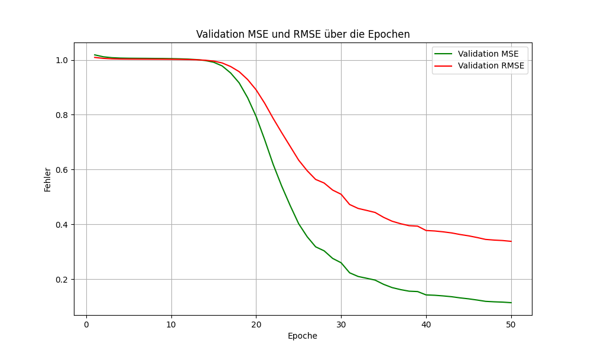

# Experiment 1: Attention-Based Multi-Input LSTM for Bitcoin Price Prediction

## Kurzbeschreibung
Das Ziel dieses Projekts ist die Vorhersage der Kursänderung (prozentualer Gewinn/Verlust) von Bitcoin, basierend auf historischen Daten und technischen Indikatoren. Das Modell verwendet eine auf Attention basierende Multi-Input LSTM-Architektur.
---

---
## Datenbeschaffung
- **Datenquelle**: `yfinance`
- **Kryptowährung**: Bitcoin (`BTC-USD`)
- **Zeitraum**: 2010-01-01 bis 2023-01-31
- **Aufteilung**:
  - Trainingsdaten: 2010-2022
  - Testdaten: 2023
- **Merkmale (Features)**:
  - **Standard**: Open, High, Low, Close, Volume
  - **Indikatoren-Gruppe 1**: RSI, MACD, MACD-Signal, Momentum, Stochastic Oscillator
  - **Indikatoren-Gruppe 2**: CCI, ROC, Bollinger-Bänder (oberes und unteres Band)
- **Zielvariable**: Vorhergesagter Preis 30 Tage in die Zukunft.

### **Standard Features**
1. **Open**: Der Eröffnungspreis der Kryptowährung an einem bestimmten Tag.
2. **High**: Der höchste Preis der Kryptowährung an einem bestimmten Tag.
3. **Low**: Der niedrigste Preis der Kryptowährung an einem bestimmten Tag.
4. **Close**: Der Schlusskurs der Kryptowährung an einem bestimmten Tag.
5. **Volume**: Das Handelsvolumen, d. h. die Menge an gehandelten Kryptowährungseinheiten an einem bestimmten Tag.

### **Momentum-Indikatoren (Indicators Group 1)**
1. **RSI (Relative Strength Index)**:
   - Ein technischer Indikator, der die Geschwindigkeit und Änderung der Kursbewegungen misst.
   - Werte über 70 deuten auf eine überkaufte Situation hin, während Werte unter 30 auf eine überverkaufte Situation hinweisen.
2. **MACD (Moving Average Convergence Divergence)**:
   - Zeigt den Unterschied zwischen zwei gleitenden Durchschnitten des Kurses (schneller und langsamer Durchschnitt).
   - Wird verwendet, um Trends und Umkehrpunkte zu erkennen.
3. **MACD-Signal**:
   - Ein gleitender Durchschnitt des MACD.
   - Dient als Signallinie, um Kauf- und Verkaufssignale zu generieren.
4. **Momentum**:
   - Die Kursänderung zwischen zwei aufeinanderfolgenden Tagen.
   - Positiv, wenn der Kurs steigt, und negativ, wenn er fällt.
5. **Stochastic Oscillator**:
   - Zeigt die relative Position des Schlusskurses im Verhältnis zu dessen Hoch- und Tiefpunkten über eine bestimmte Periode.
   - Werte über 80 deuten auf eine überkaufte Situation hin, während Werte unter 20 auf eine überverkaufte Situation hinweisen.

### **Volatilitäts-Indikatoren (Indicators Group 2)**
1. **CCI (Commodity Channel Index)**:
   - Misst die Abweichung des Kurses von seinem Durchschnitt.
   - Hohe Werte zeigen, dass der Kurs über seinem Durchschnitt liegt (möglicherweise überkauft), während niedrige Werte auf das Gegenteil hindeuten.
2. **ROC (Rate of Change)**:
   - Prozentsatz der Kursänderung über einen bestimmten Zeitraum.
   - Misst die Stärke und Richtung des Trends.
3. **Bollinger-Bänder (Upper Band)**:
   - Das obere Bollinger-Band zeigt den Kursbereich, in dem die Preise normalerweise bleiben sollten.
   - Es wird basierend auf einem gleitenden Durchschnitt und der Standardabweichung berechnet.
4. **Bollinger-Bänder (Lower Band)**:
   - Das untere Bollinger-Band zeigt ebenfalls den erwarteten Kursbereich an.
   - Werte außerhalb der Bollinger-Bänder deuten auf eine hohe Volatilität hin.

## **Architektur und detaillierte Funktionsweise**

Das Modell ist modular aufgebaut, um mehrere Eingabedatenquellen zu kombinieren und mithilfe von LSTM-, Gating- und Attention-Mechanismen Vorhersagen zu treffen. Im Folgenden wird die Funktionalität der Komponenten detailliert beschrieben.

---

### **1. Architektur**

1. **Standard-Features (z. B. OHLCV)**:
   - Verarbeitet durch einen separaten `CustomLSTM`-Layer.
   - Nutzt Preisdaten und Volumen als Basisfeatures.

2. **Momentum-Indikatoren (Gruppe 1)**:
   - Verarbeitet von einem weiteren `CustomLSTM`.
   - Momentum-Indikatoren wie RSI, MACD, ROC dienen als Eingangsdaten.

3. **Volatilitäts-Indikatoren (Gruppe 2)**:
   - Verarbeitet von einem separaten `CustomLSTM`.
   - Nutzt Indikatoren wie Bollinger-Bänder und CCI.

4. **Multi-Input-LSTM mit Gating**:
   - Kombiniert die Ausgaben der drei LSTMs.
   - Verwendet ein Gating-Mechanismus zur Gewichtung der Inputs.

5. **Dual Attention Layer**:
   - Wendet zeitbasierte und feature-basierte Gewichtungen an.
   - Verstärkt relevante Informationen zur Verbesserung der Vorhersage.

6. **Fusion Fully Connected Layer**:
   - Kombiniert alle Eingaben durch eine Feedforward-Schicht.
   - Liefert die finale Ausgabe in Form der Vorhersage.

---

### **2. Klassen und Funktionen**

#### **a) `ThreeGroupLSTMModel`**
- **Zweck**: Verarbeitet drei verschiedene Eingabedatenquellen.
- **Input**:
  - `Y`: Standard-Features.
  - `X1`: Momentum-Indikatoren.
  - `X2`: Volatilitäts-Indikatoren.
- **Architektur**:
  - Separate `CustomLSTM`-Layer für jede Eingabedatenquelle.
  - Kombiniert die Ausgaben mit einem `MultiInputLSTMWithGates`.
  - Wendet `DualAttention` an, um relevante Features und Zeitpunkte zu gewichten.
  - Gibt die finale Sequenz durch eine `Fully Connected`-Schicht aus.

#### **b) `FusionModel`**
- **Zweck**: Kombiniert die Ausgaben mehrerer `ThreeGroupLSTMModel`.
- **Input**:
  - Sequenzen aus drei Feature-Gruppen (Standard, Indikatoren 1 und 2).
- **Architektur**:
  - Nutzt drei `ThreeGroupLSTMModel`-Instanzen (je eine pro Feature-Gruppe).
  - Kombiniert die Ausgaben entlang der Feature-Dimension.
  - Verarbeitet die kombinierten Daten mit einer `Fully Connected`-Schicht, um die finale Vorhersage zu generieren.

#### **c) `CustomLSTM`**
- **Zweck**: Verarbeitet einzelne Eingabesequenzen mit Long Short-Term Memory (LSTM).
- **Input**:
  - Zeitliche Sequenzen mit mehreren Features.
- **Architektur**:
  - Mehrschichtiges LSTM mit Dropout.
  - Gibt die vollständige Sequenz und die versteckten Zustände aus.

#### **d) `MultiInputLSTMWithGates`**
- **Zweck**: Kombiniert mehrere Eingabesequenzen.
- **Mechanismus**:
  - Modifiziert jede Eingabe (z. B. Momentum und Volatilität) basierend auf einem Gating-Signal.
  - Verwendet ein LSTM, um die kombinierten Daten zu verarbeiten.
- **Output**:
  - Sequenz und die letzten versteckten Zustände.

#### **e) `DualAttention`**
- **Zweck**: Verstärkt relevante Informationen in den kombinierten Sequenzen.
- **Mechanismus**:
  - Zeitliche Aufmerksamkeit: Gewichtung von Sequenzschritten.
  - Feature-Aufmerksamkeit: Gewichtung der Eingabefeatures.
- **Output**:
  - Gewichtetete und verstärkte Sequenz.

---

### **3. Trainingsfunktion**

#### **`train_fusion_model`**
- **Input**:
  - Trainingsdaten: Sequenzen aus drei Feature-Gruppen (Standard, Momentum, Volatilität).
  - Zielwerte: Erwartete Vorhersagen für jede Sequenz.
  - Modellparameter: `hidden_dim`, `batch_size`, `learning_rate`, `epochs`.
- **Ablauf**:
  1. **Datenaufteilung**:
     - Der Datensatz wird in Trainings- und Validierungsdaten aufgeteilt (z. B. 80% Training, 20% Validierung).
  2. **Modellinitialisierung**:
     - Erstellt eine Instanz von `FusionModel`.
  3. **Datenverarbeitung**:
     - Nutzt `DataLoader` zum Batch-Wise-Laden der Daten.
  4. **Training und Validierung**:
     - **Training**:
       - Eingabedaten werden durch das Modell verarbeitet.
       - Der Verlust wird mit dem **Mean Squared Error (MSE)** berechnet.
       - Backpropagation und Optimierung der Modellparameter erfolgen mit dem Adam-Optimierer.
     - **Validierung**:
       - Die Modellleistung wird auf unsichtbaren Validierungsdaten gemessen.
       - Es werden Validierungsmetriken wie **MSE**, **RMSE** berechnet.
  5. **Speicherung**:
     - Speichert das trainierte Modell als `.pth`.
  6. **Visualisierung**:
     - Erstellt Plots für Trainings- und Validierungsverlust sowie Validierungsmetriken (MSE, RMSE, R²) über die Epochen.

---

### **4. Testskript**

Das Testskript (siehe vorherigen Abschnitt) lädt das trainierte Modell, verarbeitet Testdaten und evaluiert die Vorhersagegenauigkeit. Wichtige Schritte:
1. **Daten laden und vorbereiten**:
   - Historische Kursdaten und technische Indikatoren werden sequenziert.
2. **Vorhersage durchführen**:
   - Verwendet das Modell, um den zukünftigen Preis vorherzusagen.
3. **Leistung bewerten**:
   - Berechnet Fehlermaße wie MSE, RMSE, und prozentualen Fehler.
4. **Visualisierung**:
   - Plottet den tatsächlichen und vorhergesagten Kursverlauf.

---

### **5. Parameter und Feature-Bedeutung**

#### **Parameter**:
- `hidden_dim`: Dimension der versteckten Schichten.
- `seq_length`: Länge der Eingabesequenzen.
- `batch_size`: Anzahl der Sequenzen pro Batch.
- `learning_rate`: Schrittweite des Optimierungsalgorithmus.
- `epochs`: Anzahl der Iterationen über den gesamten Datensatz.
---
### **6. Verlust- und Metrikenberechnung**

#### **a) Trainingsverlust**
- Der Trainingsverlust misst, wie gut das Modell die Vorhersagen auf den Trainingsdaten macht. Er wird während des Trainings für jeden Batch berechnet und über alle Batches einer Epoche gemittelt.
- Ein niedriger Trainingsverlust zeigt, dass das Modell die Muster in den Trainingsdaten gut gelernt hat.
- Bei einem sehr niedrigen Trainingsverlust kann jedoch die Gefahr bestehen, dass das Modell die Trainingsdaten auswendig lernt (Overfitting), was die Leistung auf neuen Daten beeinträchtigen könnte.

#### **b) Validierungsverlust**
- Der Validierungsverlust misst, wie gut das Modell Vorhersagen auf Daten macht, die während des Trainings nicht verwendet wurden (Validierungsdaten).
- Er wird am Ende jeder Epoche berechnet, indem die Vorhersagen des Modells mit den tatsächlichen Werten in den Validierungsdaten verglichen werden.
- Ein steigender Validierungsverlust bei gleichzeitig sinkendem Trainingsverlust kann ein Zeichen von Overfitting sein.

#### **c) Mean Squared Error (MSE)**
- Der MSE ist ein Maß dafür, wie weit die Vorhersagen des Modells im Durchschnitt von den tatsächlichen Werten abweichen. Er gibt einen Durchschnitt über alle Abweichungen an, wobei größere Fehler stärker gewichtet werden.
- Ein niedriger MSE zeigt an, dass das Modell die tatsächlichen Werte gut vorhersagen kann.

#### **d) Root Mean Squared Error (RMSE)**
- Der RMSE ist die Quadratwurzel des MSE und hat die gleiche Einheit wie die ursprünglichen Daten (z. B. Preis in USD).
- Er ist intuitiver als der MSE, da er den Fehler direkt in der Skala der Vorhersagen angibt.
- Ein niedriger RMSE bedeutet, dass die Vorhersagen des Modells insgesamt nah an den tatsächlichen Werten liegen.

#### **Zusammenfassung**
- **Trainingsverlust**: Misst die Leistung des Modells auf den Trainingsdaten und wird genutzt, um das Modell während des Trainings zu optimieren.
- **Validierungsverlust**: Misst die Leistung auf neuen, unsichtbaren Daten und hilft, die Generalisierungsfähigkeit des Modells zu bewerten.
- **MSE und RMSE**: Helfen dabei, die Vorhersagegenauigkeit zu quantifizieren. Beide Metriken sind besonders nützlich, um die durchschnittliche Abweichung zwischen Vorhersagen und tatsächlichen Werten zu verstehen.

---
### **7. Plots und Visualisierung**

#### **a) Trainings- und Validierungsverlust**
- Visualisiert den Verlust für Training und Validierung über die Epochen.
- Ziel: Erkennen von Overfitting (z. B. wenn der Validierungsverlust steigt, während der Trainingsverlust sinkt).

#### **b) Validierungsmetriken (MSE, RMSE, R²)**
- Zeigt die Entwicklung der Metriken für die Validierungsdaten über die Epochen.
- Ziel: Sicherstellen, dass das Modell stabil konvergiert und sich die Vorhersageleistung verbessert.

---


## **Testskript - Funktionsweise und Ablauf**

Das Testskript ist für die Validierung des trainierten Modells auf Testdaten entwickelt. Es evaluiert die Vorhersagegenauigkeit anhand definierter Fehlermaße und zeigt die tatsächlichen sowie vorhergesagten Preise. Nachfolgend wird die Funktionsweise Schritt für Schritt erläutert:

### **1. Initialisierung und Vorbereitung**
- **Setzen von Zufallszahlen-Seed**: 
  - Für Python, NumPy und PyTorch werden Seeds gesetzt, um reproduzierbare Ergebnisse sicherzustellen.
  - Falls CUDA genutzt wird, werden zusätzliche Seeds für GPU-Operationen gesetzt.
- **Gerätekonfiguration**:
  - Das Skript prüft, ob CUDA verfügbar ist, und wählt automatisch GPU oder CPU als Rechengerät aus.

---

### **2. Funktionen**

#### **a) Berechnung technischer Indikatoren**
- `calculate_indicators(df)`:
  - Berechnet technische Indikatoren wie RSI, MACD, Bollinger-Bänder etc. basierend auf historischen Kursdaten.
  - Entfernt NaN-Werte und gibt einen erweiterten DataFrame zurück.

#### **b) Laden von Testdaten**
- `load_test_data(symbol, seq_length, forecast_start)`:
  - Lädt historische Preisdaten für die angegebene Kryptowährung (z. B. `BTC-USD`) mithilfe der `yfinance`-Bibliothek.
  - Berechnet technische Indikatoren und kombiniert diese mit Preis- und Volumendaten.
  - Gibt einen bereinigten DataFrame zurück.

#### **c) Sequenzierung der Daten**
- `prepare_test_sequences(test_data, scaler, group_features, seq_length)`:
  - Standardisiert die Testdaten mithilfe eines vorher gespeicherten Scalers.
  - Generiert Eingabesequenzen für jede Feature-Gruppe (Standard, Indikatoren-Gruppe 1, Indikatoren-Gruppe 2).
  - Gibt die sequenzierten Daten als Tensoren zurück.

---

### **3. Hauptablauf**

#### **a) Datenvorbereitung**
1. **Scaler laden**:
   - Der vorher gespeicherte `StandardScaler` wird geladen, um Testdaten zu standardisieren.
2. **Testdaten laden**:
   - Historische Kursdaten und technische Indikatoren werden geladen und bereinigt.
3. **Sequenzgenerierung**:
   - Die Testdaten werden in Eingabesequenzen umgewandelt, passend zur Architektur des Modells.

#### **b) Modell laden**
- Das trainierte Modell (`FusionModel`) wird von der Festplatte geladen und in den Evaluierungsmodus (`eval()`) versetzt.

#### **c) Vorhersage**
1. **Daten an das Modell übergeben**:
   - Die generierten Sequenzen für Standard-Features und Indikator-Gruppen werden dem Modell übergeben.
2. **Skalierung zurücksetzen**:
   - Die Vorhersage wird aus dem skalierten Wertebereich in den ursprünglichen Wertebereich zurücktransformiert.
3. **Berechnung von Fehlermaßen**:
   - **Tatsächlicher Gewinn**: Differenz zwischen Anfangs- und Endpreis.
   - **Vorhergesagter Gewinn**: Differenz zwischen Anfangs- und vorhergesagtem Endpreis.
   - **MSE**: Durchschnitt der quadrierten Abweichungen.
   - **RMSE**: Quadratwurzel des MSE.
   - **Absoluter Fehler**: Differenz zwischen tatsächlichem und vorhergesagtem Preis.
   - **Prozentualer Fehler**: Fehler relativ zum tatsächlichen Preis.
   - **R² (Bestimmtheitsmaß)**: Gibt an, wie gut die Vorhersagen die tatsächlichen Werte erklären können. Ein Wert nahe 1 zeigt eine hohe Übereinstimmung zwischen Modell und Daten, während ein Wert nahe 0 eine schlechte Anpassung anzeigt.

#### **d) Visualisierung**
- Ein Preisdiagramm wird erstellt, das den tatsächlichen Verlauf und die Vorhersagen zeigt:
  - Historischer Preisverlauf.
  - Tatsächlicher und vorhergesagter Endpreis.
  - Kaufpreis zu Beginn des Testzeitraums.

---

### **4. Ausgabe**
Das Skript gibt die Ergebnisse der Modellbewertung aus:
- Kaufpreis, tatsächlicher Endpreis, vorhergesagter Endpreis.
- Berechnete Fehlermaße:
  - MSE, RMSE, absoluter und prozentualer Fehler.
- Ein Diagramm zeigt die Kursentwicklung und die Vorhersagen.

---

### **Wichtige Hinweise**
- **Fehlerbehandlung**:
  - Das Skript behandelt Fehler wie fehlende Daten oder Ladeprobleme und beendet sich mit einer Fehlermeldung, falls kritische Schritte scheitern.
- **Erweiterbarkeit**:
  - Die Struktur erlaubt es, weitere technische Indikatoren hinzuzufügen oder die Visualisierung anzupassen.

## Baseline
- **MSE-Baseline**: Durchschnittliche Kursänderung aller vorherigen Tage als Vorhersage.

## Ausführung
### Dateien
- **`experiment_1_data_processing.py`**: 
  - Bereitet die Daten vor, berechnet technische Indikatoren und erstellt Sequenzen.
  - **Eingabe**: Historische Kursdaten (`yfinance`).
  - **Ausgabe**: Sequenzen (`Standard_X.pkl`, `Indicators_Group_1_X.pkl`, `Indicators_Group_2_X.pkl`).

- **`experiment_1_model_layer.py`**: 
  - Definiert die Bausteine des Modells:
    - Custom LSTM
    - Multi-Input LSTM mit Gating
    - Dual Attention Layer

- **`experiment_1_model.py`**: 
  - Enthält die Modelllogik für Training und Evaluation.
  - Trainiert das Modell und speichert die Ergebnisse in `fusion_model_final.pth`.

- **`experiment_1.py`**: 
  - Führt Vorhersagen auf Testdaten aus und visualisiert die Ergebnisse.
  - **Eingabe**: `fusion_model_final.pth`, Testdaten von `yfinance`.
  - **Ausgabe**: Vorhergesagte Preise und Performance-Metriken.

### Schritte zur Ausführung
0. **Verzeichnis Wechseln**
    ```bash
    cd src/Experiment_1
    ```
1. **Datenverarbeitung**:
   ```bash
   python experiment_1_data_processing.py
   ```

Ergebnis: Generiert die vorbereiteten Sequenzen in ./Data/Samples/.

2. **Training des Modells:**:
   ```bash
   python experiment_1_model.py
   ```
Ergebnis: Trainiert das Modell und speichert es unter ./Data/Models/fusion_model_final.pth.

3. **Vorhersagen und Evaluation:**:
   ```bash
   python experiment_1.py
   ```
Ergebnis: Zeigt die vorhergesagten Preise, Fehlermaße und einen Plot des Kursverlaufs.

4. **Visualisierung des Modells**:
    ```bash
   python experiment_1_tensorboard.py
   ```
   ```bash
   python experiment_1_netron.py
   ```
   ```bash
   python experiment_1_torchviz.py
   ```

## Training



## Ergebnisse
- Kaufpreis am 2023-02-01: 23723.76953125
- Tatsächlicher Preis am 2023-03-02: 23475.466796875
- Vorhergesagter Preis: 24441.06708843768
- Tatsächlicher Gewinn: -248.302734375
- Vorhergesagter Gewinn: 717.2975571876814
- MSE im Preis: 932383.9230659353
- RMSE im Preis: 965.6002915626814
- Absoluter Fehler: 965.6002915626814
- Prozentualer Fehler: 4.1132%
- R² (Bestimmtheitsmaß): 0.9983