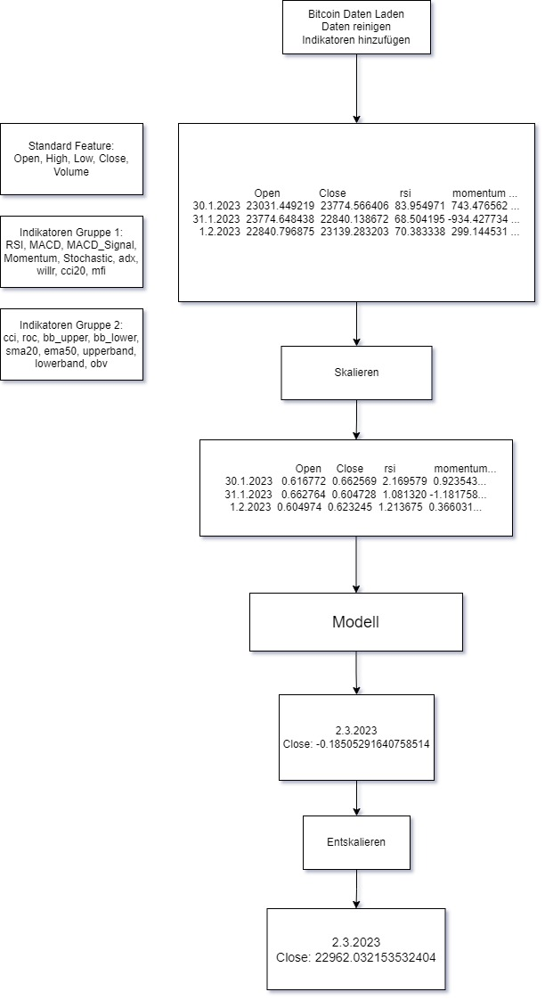
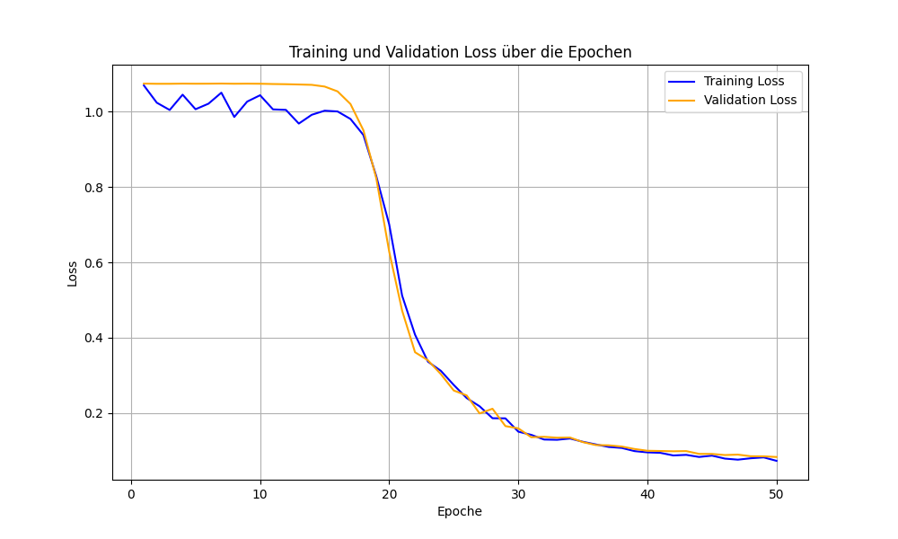
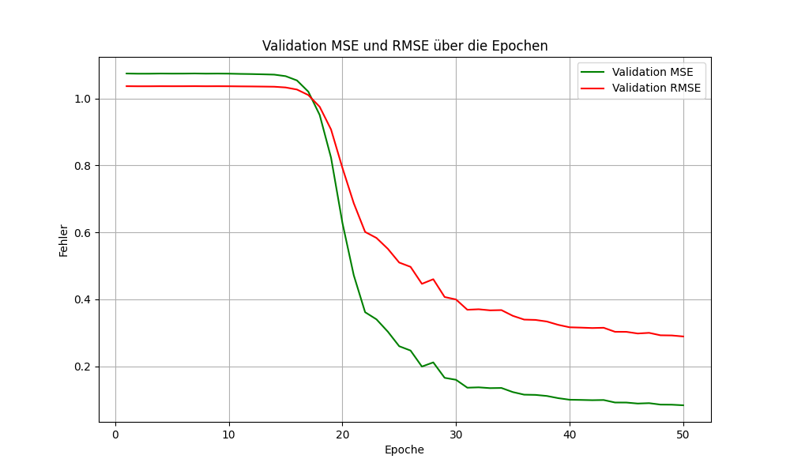

# Experiment 2

## Kurzbeschreibung
Experiment 2 erweitert die Basis von Experiment 1 durch zusätzliche technische Indikatoren und kleinere Anpassungen in der Datenverarbeitung sowie in der Modellarchitektur.

---

---

## Änderungen im Data Processing
1. **Zusätzliche technische Indikatoren**:
   - **ADX (Average Directional Index)**: Bewertet die Stärke eines Trends.
   - **WILLR (Williams %R)**: Identifiziert überkaufte oder überverkaufte Zustände.
   - **CCI20 (Commodity Channel Index, 20 Zeitperioden)**: Alternative zum ursprünglichen CCI.
   - **MFI (Money Flow Index)**: Verknüpft Volumen- und Preisänderungen.
   - **SMA20 (Simple Moving Average)**: 20-Tage-Durchschnitt zur Glättung kurzfristiger Trends.
   - **EMA50 (Exponential Moving Average)**: 50-Tage-Durchschnitt mit exponentieller Gewichtung.
   - **BBANDS (Bollinger Bands)**: Zusätzliche Konfiguration mit `nbdevup=2` und `nbdevdn=2`.
   - **OBV (On-Balance Volume)**: Misst den kumulierten Geldfluss relativ zu Preistrends.

2. **Feature-Gruppen-Erweiterung**:
   - **Indicators_Group_1**:
     - Erweitert durch ADX, WILLR, CCI20 und MFI.
   - **Indicators_Group_2**:
     - Ergänzt durch SMA20, EMA50, Bollinger-Bänder und OBV.

3. **Sequenzgenerierung**:
   - Zielspaltenanzahl (`target_feature_dim`) wird explizit geprüft und bei Bedarf zugeschnitten.

---

## Änderungen in der Modellarchitektur
1. **ThreeGroupLSTMModel**:
   - **Eingabedimensionen angepasst**:
     - Indicators_Group_1: Erweitert auf 9 Dimensionen.
     - Indicators_Group_2: Erweitert auf 9 Dimensionen.

2. **FusionModel**:
   - Keine strukturellen Änderungen, jedoch Berücksichtigung der erweiterten Eingabedimensionen.

---

## Änderungen im Training
1. **Gradienten-Skalierung**:
   - Nutzung von `torch.cuda.amp.GradScaler`, um die Trainingseffizienz zu verbessern (Mixed-Precision-Training).
2. **Plots der Validierungsmetriken**:
   - Trainings- und Validierungs-Loss (MSE, RMSE) werden für eine bessere Nachverfolgung visuell dargestellt.

---

## Änderungen im Testskript
1. **Neue technische Indikatoren in Sequenzen**:
   - Zusätzliche Indikatoren aus den erweiterten Feature-Gruppen werden integriert.
2. **Skalierung von `Close`**:
   - Ein separater `StandardScaler` wird explizit auf das `Close`-Feature angewandt, um Vorhersagen korrekt zu transformieren.

---

## Zusammenfassung
Experiment 2 erweitert die Feature-Sets und passt die Modell-Eingabedimensionen an. Durch die Einführung zusätzlicher technischer Indikatoren und die Optimierung der Trainingseffizienz werden die Modellvorhersagen präziser und das Training wird stabiler.

## Training

## Ergebnis
- Kaufpreis am 01.02.2023: 23723.76953125
- Tatsächlicher Preis am 02.03.2023: 23475.466796875
- Vorhergesagter Preis: 22962.032153532404
- Tatsächlicher Gewinn: -248.302734375
- Vorhergesagter Gewinn: -761.7373777175962
- MSE im Preis: 263615.132984339
- RMSE im Preis: 513.4346433425962
- R² (Bestimmtheitsmaß): 0.9995
- Absoluter Fehler: 513.4346433425962
- Prozentualer Fehler: 2.1871%