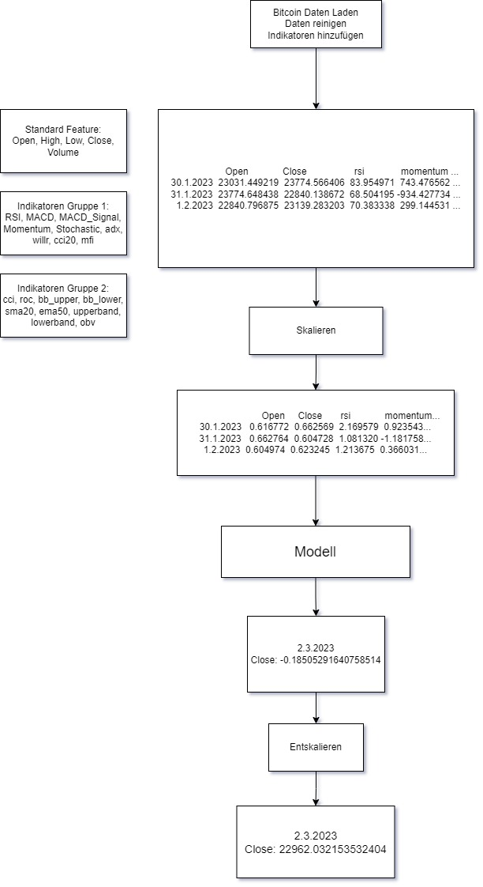

# Experiment 3

## Kurzbeschreibung
Experiment 3 erweitert die Funktionalität von Experiment 2 durch die Einführung von dynamischen LSTM-Schichten, Dual-Attention-Mechanismen und weiteren Verbesserungen in der Datenvorbereitung und Modellarchitektur.

---

---

## Änderungen im Data Processing
1. **Korrelation und Autoencoder kombiniert**:
   - Technische Indikatoren werden anhand der Korrelation mit dem Zielwert (`Close`) gefiltert. 
   - Ein **Autoencoder** wird eingesetzt, um nicht-lineare Merkmalsreduktion für jede Feature-Gruppe durchzuführen.

2. **Zusätzliche Features und Gruppierung**:
   - Die bestehenden Feature-Gruppen wurden erweitert:
     - **Standard-Gruppe**: Keine Änderungen.
     - **Indicators_Group_1**: Keine Änderungen.
     - **Indicators_Group_2**: Keine Änderungen.
   - Korrelation mit `Close` reduziert die Features pro Gruppe auf relevante Dimensionen.

3. **Sequenzgenerierung**:
   - Die Sequenzen werden mit der Funktion `generate_sequences` erstellt, die eine höhere Flexibilität bei Eingabe- und Vorhersagesequenzen bietet.

---

## Änderungen in der Modellarchitektur
1. **DynamicLSTMModel**:
   - Dynamische LSTM-Schichten für unterschiedliche Eingabegrößen der Feature-Gruppen.
   - **Dual Attention Layer**: Führt sowohl zeitbasierte als auch featurebasierte Aufmerksamkeit ein.

2. **MultiInputLSTMWithGates**:
   - Integrierter **Gate-Mechanismus**, um Signale von mehreren Eingaben adaptiv zu gewichten und zu kombinieren.

3. **Fusion Model**:
   - Drei separate **DynamicLSTMModel**-Instanzen für die jeweiligen Gruppen.
   - Fusion der Ausgaben durch eine vollständig verbundene Schicht.

---

## Änderungen im Training
1. **Training mit Gradienten-Skalierung**:
   - Verwendung von `torch.cuda.amp.GradScaler`, um das Training mit gemischter Präzision zu stabilisieren.

2. **Neue Metriken**:
   - Berechnung von R², absoluten Fehlern und prozentualen Fehlern.

3. **Plots und Visualisierungen**:
   - Detaillierte Plots für MSE, RMSE und Trainings-/Validierungsverluste.

---

## Änderungen im Testskript
1. **Dynamische LSTM-Vorhersage**:
   - Das Modell verarbeitet dynamisch die Eingaben der drei Gruppen, um Vorhersagen zu erzeugen.

---

## Zusammenfassung
Experiment 3 führt eine komplexere Modellarchitektur mit Attention-Mechanismen ein, optimiert die Feature-Auswahl durch Autoencoder und Korrelation, und verbessert die Vorhersagegenauigkeit durch zusätzliche Metriken und optimierte Visualisierungen.

## Training

## Ergebnis
- Kaufpreis am 2023-02-01: 23723.76953125
- Tatsächlicher Preis am 2023-03-02: 23475.466796875
- Vorhergesagter Preis: 23139.476272299886
- Tatsächlicher Gewinn: -248.302734375
- Vorhergesagter Gewinn: -584.2932589501143
- MSE im Preis: 112889.63260426045
- RMSE im Preis: 335.99052457511425
- R² (Bestimmtheitsmaß): 0.9998
- Absoluter Fehler: 335.99052457511425
- Prozentualer Fehler: 1.431241%

