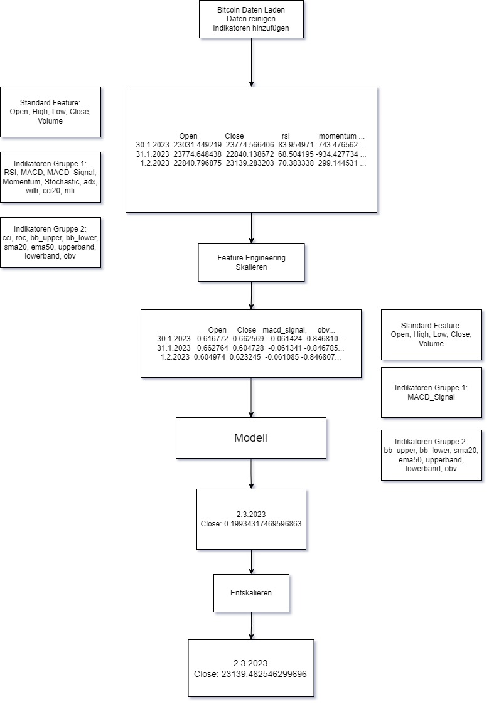
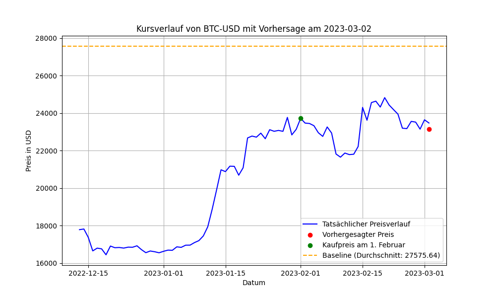

# Experiment 4 

## Kurzbeschreibung
Experiment 4 erweitert die Modellarchitektur und Datenverarbeitung durch verbesserte LSTM-Schichten mit adaptiver Residualverbindung, Layer-Normalisierung und optimierten Dropout-Mechanismen. Es wurden Anpassungen vorgenommen, um die Stabilität und Genauigkeit des Modells weiter zu verbessern.

---

---

## Änderungen im Data Processing
1. **Keine Änderungen in den Features oder Sequenzen**:
   - Die technische Indikatorberechnung, Korrelation und Autoencoder-basierte Feature-Reduktion bleiben unverändert.

2. **Modellierte Daten bleiben kompatibel**:
   - Die generierten Sequenzen (X und Y) sind direkt kompatibel mit der neuen Modellarchitektur.

---

## Änderungen in der Modellarchitektur
1. **Verbesserter `CustomLSTM`**:
   - **Layer-Normalisierung**: Jede LSTM-Ausgabe wird normalisiert, um die Stabilität und Konvergenz des Trainings zu verbessern.
   - **Adaptive Residualverbindung**: Eine Residualschicht wurde hinzugefügt, die die ursprüngliche Eingabe mit adaptiv gewichteten LSTM-Ausgaben kombiniert.
   - **Verbessertes Dropout**: Residual-Dropout wurde separat implementiert, um die Generalisierungsfähigkeit des Modells zu stärken.

2. **Unveränderte Dual-Attention und Multi-Input LSTM**:
   - Die bestehenden Attention- und Multi-Input-Mechanismen bleiben unverändert, um die Effizienz der Gruppenkombination beizubehalten.

---

## Änderungen im Training
1. **Anpassungen der LSTM-Hyperparameter**:
   - Dropout-Rate in `CustomLSTM` wurde auf **0.4** erhöht, um Überanpassungen bei komplexeren Daten zu vermeiden.

2. **Optimierte Residualverarbeitung**:
   - Residualgewichte werden durch ein neuronales Netzwerk dynamisch berechnet, um den Beitrag der Residualverbindung adaptiv zu steuern.

---

## Änderungen im Testskript
1. **Keine Änderungen in der Testlogik**:
   - Testdatenvorbereitung und Vorhersagepipeline sind unverändert.

2. **Kompatibilität zur neuen Modellarchitektur**:
   - Das neue Modell verwendet dieselbe API wie in Experiment 3, sodass bestehende Skripte ohne Änderungen genutzt werden können.

---

## Zusammenfassung
Experiment 4 baut auf Experiment 3 auf, indem es die LSTM-Architektur durch Residualverbindungen, Layer-Normalisierung und verbessertes Dropout erweitert. Diese Änderungen zielen darauf ab, die Modellstabilität und Vorhersagegenauigkeit zu verbessern, insbesondere bei längeren Sequenzen und komplexen Daten.

## Training

## Ergebnis

- Kaufpreis am 2023-02-01: 23723.76953125
- Tatsächlicher Preis am 2023-03-02: 23475.466796875
- Vorhergesagter Preis: 23139.482546299696
- Tatsächlicher Gewinn: -248.302734375
- Vorhergesagter Gewinn: -584.286984950304
- MSE im Preis: 112885.41663464869
- RMSE im Preis: 335.98425057530403
- R² (Bestimmtheitsmaß): 0.9998
- Absoluter Fehler: 335.98425057530403
- Prozentualer Fehler: 1.431214%
