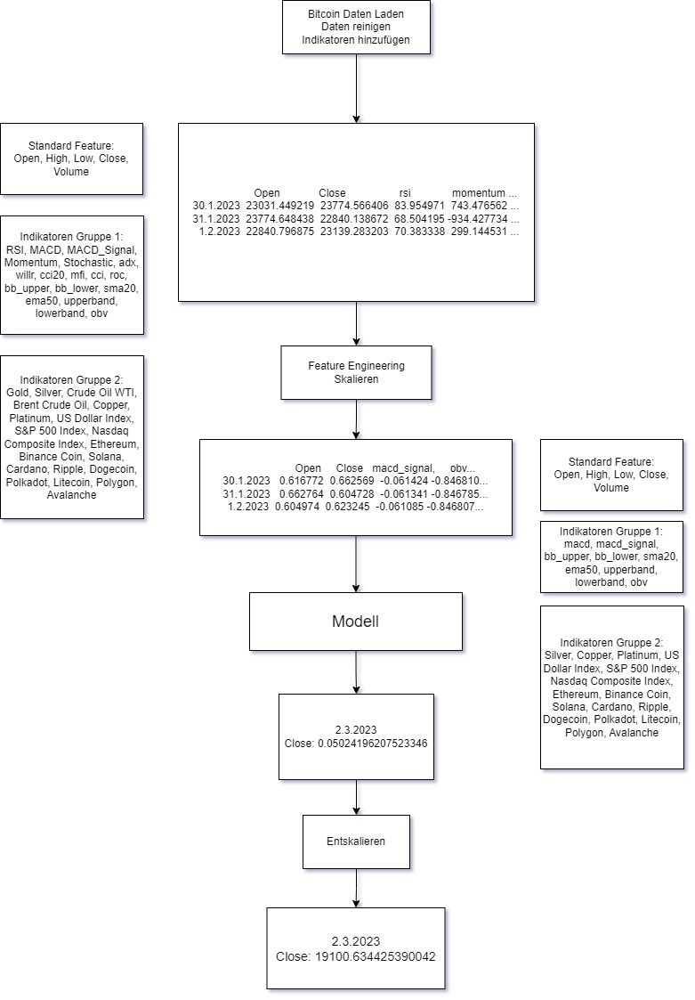
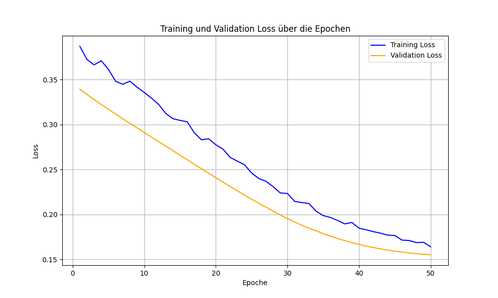
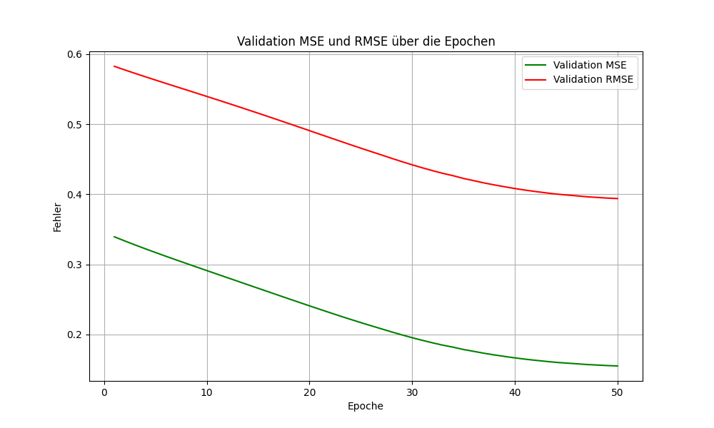

# Experiment 5 

## Kurzbeschreibung
Experiment 5 erweitert das bestehende Modell und die Datenverarbeitung, um den Einfluss von externen Märkten und weiteren Kryptowährungen auf die Vorhersagegenauigkeit zu untersuchen. Es wurden zusätzliche Features (z. B. Rohstoffpreise, Indizes) integriert, und die Verarbeitung der Daten wurde verbessert.

---

---

## Änderungen im Data Processing
1. **Erweiterung der Datenquellen**:
   - Zusätzliche Märkte und Kryptowährungen wurden hinzugefügt, darunter Rohstoffe (z. B. Gold, Silber), Indizes (z. B. S&P 500, NASDAQ) und weitere Kryptowährungen (z. B. Ethereum, Solana).

2. **Integration externer Daten in `Indicators_Group_2`**:
   - `Indicators_Group_2` enthält jetzt Preise für externe Symbole wie Rohstoffe und Indizes, um deren Korrelation mit der Zielkryptowährung zu untersuchen.

3. **Verbesserung der Datenbereinigung**:
   - Fehlende Werte in den externen Daten werden automatisch durch Vorwärts- und Rückwärtsfüllung (`ffill` und `bfill`) ergänzt.

4. **Skalierung der zusätzlichen Daten**:
   - Der `StandardScaler` berücksichtigt nun auch die neuen Features, um eine einheitliche Datenverarbeitung zu gewährleisten.

---

## Änderungen in der Modellarchitektur
1. **Keine Änderungen an der Architektur**:
   - Die bestehende Modellarchitektur (`FusionModel`) bleibt unverändert, da sie flexibel genug ist, um die zusätzlichen Features zu verarbeiten.

2. **Dynamische Anpassung der Input-Dimensionen**:
   - Die Input-Dimensionen wurden angepasst, um die neuen Features in `Indicators_Group_2` korrekt zu verarbeiten.

---

## Änderungen im Training
1. **Keine Änderungen an der Trainingslogik**:
   - Die Trainingspipeline und Hyperparameter bleiben unverändert.

2. **Erweiterung der Eingabedaten**:
   - Das Modell verarbeitet nun zusätzliche Features, was potenziell eine bessere Generalisierung und Vorhersagegenauigkeit ermöglicht.

---

## Änderungen im Testskript
1. **Integration externer Daten in die Tests**:
   - Die Testsequenzen berücksichtigen nun die externen Daten, um eine realistische Vorhersage basierend auf zusätzlichen Informationen zu ermöglichen.

2. **Verbesserte Fehlerbehandlung**:
   - Fehlende Daten für externe Symbole werden während des Tests automatisch ignoriert oder ergänzt.

3. **Erweiterte Plots**:
   - Die Plots enthalten weiterhin den tatsächlichen und vorhergesagten Preis, jedoch ohne separate Visualisierung der externen Daten (z. B. Rohstoffpreise).

---

## Zusammenfassung
Experiment 5 erweitert den Fokus von rein kryptowährungsbasierten Vorhersagen auf marktübergreifende Analysen. Durch die Integration von Rohstoffen, Indizes und weiteren Kryptowährungen wird das Modell mit zusätzlichen relevanten Informationen gefüttert, um mögliche Korrelationen besser auszunutzen. Die bestehende Architektur und Trainingslogik bleiben unverändert, um die Kompatibilität zu gewährleisten.

## Training

## Ergebnis
- Kaufpreis am 2023-02-01: 23723.76953125
- Tatsächlicher Preis am 2023-03-02: 23475.466796875
- Vorhergesagter Preis: 19100.634425390042
- Tatsächlicher Gewinn: -248.302734375
- Vorhergesagter Gewinn: -4623.135105859958
- MSE im Preis: 19139158.2785927
- RMSE im Preis: 4374.832371484958
- R² (Bestimmtheitsmaß): 0.9660
- Absoluter Fehler: 4374.832371484958
- Prozentualer Fehler: 18.635763%
