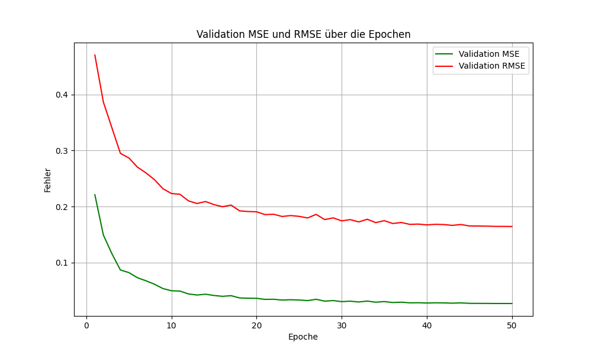

# Experiment 6 

## Kurzbeschreibung
Experiment 6 führt eine hybride Modellarchitektur ein, die LSTMs mit Convolutional Neural Networks (CNNs) kombiniert. Ziel ist es, sowohl die zeitlichen Abhängigkeiten als auch die lokalen Muster innerhalb der Features zu erfassen, um die Vorhersagegenauigkeit weiter zu verbessern.

---

---

## Änderungen im Data Processing
1. **Keine Änderungen an den Datenquellen**:
   - Die Datenquellen und Feature-Gruppen bleiben unverändert.

2. **Überprüfung der Eingabedimensionen**:
   - Sicherstellung, dass alle Eingabedaten korrekt dimensioniert und aufeinander abgestimmt sind, um die Anforderungen der erweiterten Modellarchitektur zu erfüllen.

---

## Änderungen in der Modellarchitektur
1. **Integration eines CNN-Moduls**:
   - Ein `SimpleCNN` wurde hinzugefügt, das die vollständigen Eingabedaten verarbeitet und zusätzliche Informationen für die finale Fusion bereitstellt.

2. **Hybride Fusion**:
   - Die Ausgaben der drei LSTM-Modelle (Standard, Indicators_Group_1, Indicators_Group_2) werden mit den CNN-Ausgaben kombiniert.
   - Der fusionierte Output wird durch einen vollständig verbundenen Layer (`fusion_fc`) verarbeitet, um die endgültige Vorhersage zu erstellen.

3. **Dynamische Unterstützung mehrerer Eingaben**:
   - Erweiterungen an den `DynamicLSTMModel`-Klassen erlauben die Verarbeitung variabler Eingabedimensionen.

---

## Änderungen im Training
1. **Angepasste Trainingslogik**:
   - Die Trainingspipeline wurde aktualisiert, um das neue Modell (`FusionModelWithCNN`) zu unterstützen.
   - Die CNN-Ausgabe wird in die Verlustberechnung und den Backpropagation-Prozess integriert.

2. **Keine Änderungen an den Hyperparametern**:
   - Batch-Größe, Lernrate, Epochenanzahl und andere Trainingseinstellungen bleiben unverändert.

---

## Änderungen im Testskript
1. **Anpassung an das hybride Modell**:
   - Das Testskript wurde erweitert, um die CNN-Ausgabe in die Vorhersage einzubeziehen.

2. **Fehlerbehandlung für Modellparameter**:
   - Ein Mechanismus wurde implementiert, um inkompatible Modellparameter beim Laden eines gespeicherten Modells zu ignorieren und nur passende Parameter zu übernehmen.

3. **Erweiterte Ergebnisanalyse**:
   - Zusätzliche Metriken, wie R² (Bestimmtheitsmaß), wurden ergänzt, um die Modellleistung detaillierter zu bewerten.

---

## Änderungen in der Modellarchitektur-Datei (`model_layer.py`)
1. **Anpassungen am `CustomLSTM`**:
   - Unterstützung für unterschiedliche Eingabedimensionen durch dynamische Initialisierung.

2. **Erweiterungen an `MultiInputLSTMWithGates` und `DualAttention`**:
   - Verbesserte Modulation der Eingaben durch adaptive Gewichtung mittels Attention-Mechanismen.

---

## Zusammenfassung
Experiment 6 erweitert das Modell um ein CNN-Modul, das die Erkennung von Mustern innerhalb der Features ermöglicht. Die hybride Architektur kombiniert die Vorteile von LSTMs und CNNs, um zeitliche und lokale Muster effektiv zu nutzen. Die Änderungen konzentrieren sich auf die Modellarchitektur und die Trainingslogik, während die Datenverarbeitung unverändert bleibt. Dieses Experiment dient als Grundlage für die Untersuchung, ob hybride Ansätze die Vorhersagegenauigkeit bei der Kursprognose weiter verbessern können.

## Training

## Ergebnis

- Kaufpreis am 2023-02-01: 23723.76953125
- Tatsächlicher Preis am 2023-03-02: 23475.466796875
- Vorhergesagter Preis: 18871.89256790196
- Tatsächlicher Gewinn: -248.302734375
- Vorhergesagter Gewinn: -4851.876963348041
- MSE im Preis: 21192895.681664724
- RMSE im Preis: 4603.574228973041
- R² (Bestimmtheitsmaß): 0.9623
- Absoluter Fehler: 4603.574228973041
- Prozentualer Fehler: 19.610150%
