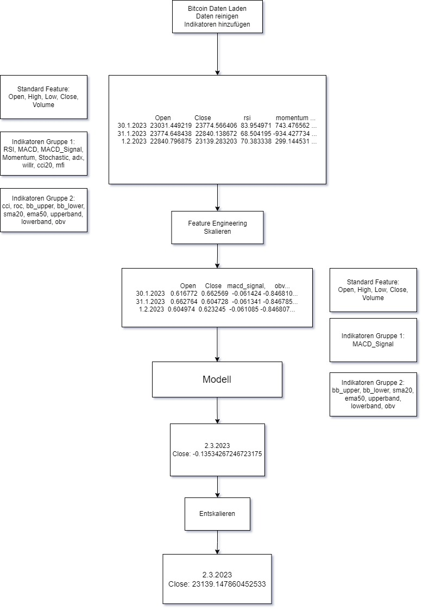
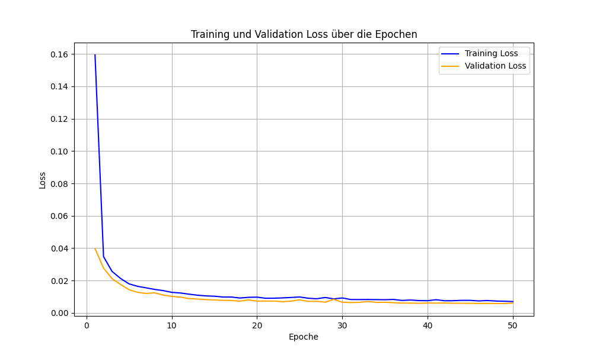
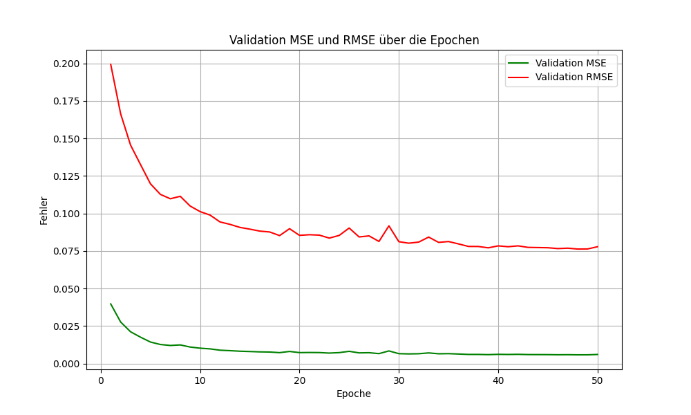
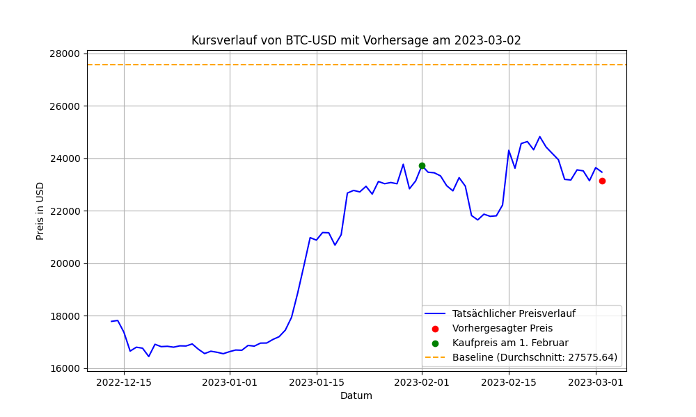

# Experiment 7

## Kurzbeschreibung
Experiment 7 fokussiert sich auf die Verfeinerung der Datenverarbeitung und eine modularere, effizientere Modellarchitektur. Der Schwerpunkt liegt auf der Verbesserung der Vorhersagegenauigkeit und einer stabileren Performance durch optimierte Gruppierungen der Indikatoren sowie dynamische Anpassungen in den Modellen.

---

---

## Änderungen im Data Processing
1. **Optimierung der Feature-Gruppen**:
   - Die Feature-Gruppen `Indicators_Group_1` und `Indicators_Group_2` wurden neu definiert und konsolidiert.
     - **Indicators_Group_1**: Momentum-bezogene Indikatoren (`rsi`, `macd`, `momentum`, etc.).
     - **Indicators_Group_2**: Trend- und Volatilitätsindikatoren (`cci`, `roc`, `bb_upper`, etc.).

2. **Automatisches Padding für kürzere Sequenzen**:
   - Ein Mechanismus wurde eingeführt, um Sequenzen mit weniger als der definierten Länge (`seq_length`) automatisch zu paddden.

3. **Korrelation mit dem Zielwert**:
   - Korrelation der Features mit dem Zielwert wird weiterhin genutzt, jedoch mit dynamischer Anpassung basierend auf den Gruppierungen.

---

## Änderungen in der Modellarchitektur
1. **Dynamische Anpassung der CNN-Komponente**:
   - Der CNN-Teil des Modells wurde modularisiert, um automatisch die Dimensionen der Eingaben zu berechnen und flexibler auf Änderungen in den Daten zu reagieren.

2. **Optimierte Fully Connected Layers**:
   - Die Anzahl der Parameter im Fusions-Layer (`fusion_fc`) wurde reduziert, um eine bessere Generalisierung zu ermöglichen.

3. **Feature-Dimensionen explizit angepasst**:
   - Unterstützung für dynamische Anpassung der Eingabedimensionen in `DynamicLSTMModel` und den LSTM-Schichten.

4. **Verbesserter Modell-Ladevorgang**:
   - Beim Laden von Modellen werden inkompatible Parameter automatisch ignoriert, um eine robuste Weiterverwendung zu gewährleisten.

---

## Änderungen im Training
1. **Keine Änderungen an Hyperparametern**:
   - Batch-Größe, Lernrate und Epochenanzahl bleiben unverändert.

2. **Effiziente Verarbeitung**:
   - Das Training wurde auf stabilere Speicherverwaltung optimiert, um größere Datensätze effizienter zu handhaben.

---

## Änderungen im Testskript
1. **Automatisches Padding für Sequenzen**:
   - Beim Testen werden unvollständige Sequenzen automatisch mit Nullen gepaddet, um Fehler bei kürzeren Zeitreihen zu vermeiden.

2. **Erweiterte Fehlerbehandlung**:
   - Verbesserte Fehlerbehandlung für fehlende oder inkonsistente Daten.

3. **Skalierung und Normalisierung**:
   - Sicherstellung, dass die Skalierung der Testdaten genau den Trainingsdaten entspricht.

4. **Zusätzliche Ergebnis-Visualisierung**:
   - Plot der vorhergesagten Werte wurde verbessert, um Diskrepanzen zwischen tatsächlichen und vorhergesagten Werten hervorzuheben.

---

## Zusammenfassung
Experiment 7 baut auf den Fortschritten von Experiment 6 auf und führt wesentliche Verbesserungen in der Datenverarbeitung und Modellarchitektur ein. Die Konsolidierung der Indikatorgruppen und die dynamische Anpassung des Modells erhöhen die Stabilität und Vorhersagegenauigkeit. Dieses Experiment dient als Basis für weitere Optimierungen in Bezug auf Performance und Modellrobustheit.

## Training

## Ergebnis

- Kaufpreis am 2023-02-01: 23723.76953125
- Tatsächlicher Preis am 2023-03-02: 23475.466796875
- Vorhergesagter Preis: 23139.147860452533
- Tatsächlicher Gewinn: -248.302734375
- Vorhergesagter Gewinn: -584.6216707974672
- MSE im Preis: 113110.42699633955
- RMSE im Preis: 336.31893642246723
- R² (Bestimmtheitsmaß): 0.9998
- Absoluter Fehler: 336.31893642246723
- Prozentualer Fehler: 1.432640%
